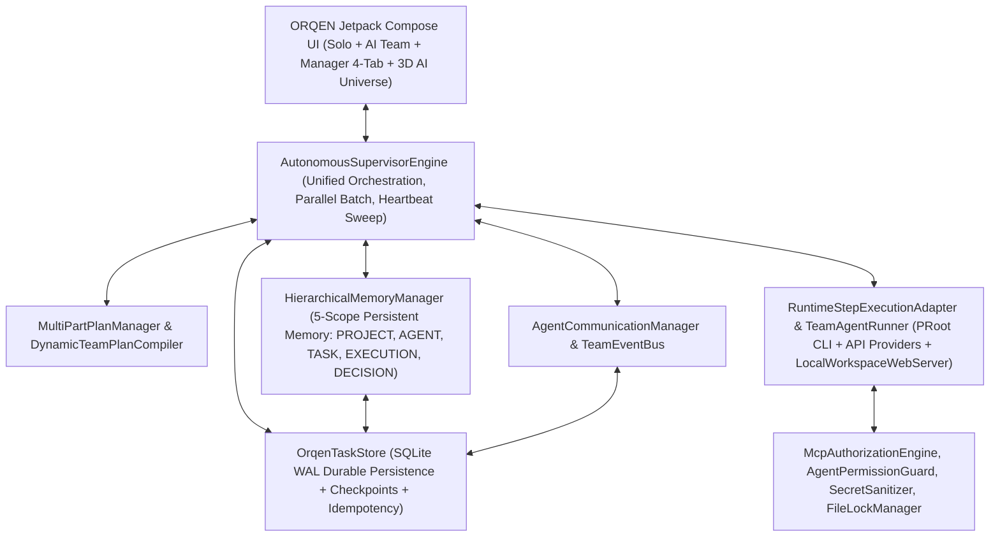
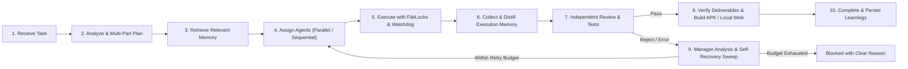

# ORQEN Architecture & Autonomous Loop Diagrams

## System Architecture

```mermaid
flowchart TB
    UI["ORQEN Jetpack Compose UI (Solo + AI Team + Manager 4-Tab + 3D AI Universe)"]
    Orch["AutonomousSupervisorEngine (Unified Orchestration, Parallel Batch, Heartbeat Sweep)"]
    Plan["MultiPartPlanManager & DynamicTeamPlanCompiler"]
    Mem["HierarchicalMemoryManager (5-Scope Persistent Memory: PROJECT, AGENT, TASK, EXECUTION, DECISION)"]
    Comm["AgentCommunicationManager & TeamEventBus"]
    Run["RuntimeStepExecutionAdapter & TeamAgentRunner (PRoot CLI + API Providers + LocalWorkspaceWebServer)"]
    Sec["McpAuthorizationEngine, AgentPermissionGuard, SecretSanitizer, FileLockManager"]
    DB["OrqenTaskStore (SQLite WAL Durable Persistence + Checkpoints + Idempotency)"]

    UI <--> Orch
    Orch <--> Plan
    Orch <--> Mem
    Orch <--> Comm
    Orch <--> Run
    Run <--> Sec
    Orch <--> DB
    Mem <--> DB
    Comm <--> DB
```

## Autonomous Execution & Self-Recovery Loop

```mermaid
flowchart LR
    A["1. Receive Task"] --> B["2. Analyze & Multi-Part Plan"]
    B --> C["3. Retrieve Relevant Memory"]
    C --> D["4. Assign Agents (Parallel / Sequential)"]
    D --> E["5. Execute with FileLocks & Watchdog"]
    E --> F["6. Collect & Distill Execution Memory"]
    F --> G["7. Independent Review & Tests"]
    G -->|Pass| H["8. Verify Deliverables & Build APK / Local Web"]
    G -->|Reject / Error| I["9. Manager Analysis & Self-Recovery Sweep"]
    I -->|Within Retry Budget| D
    I -->|Budget Exhausted| J["Blocked with Clear Reason"]
    H --> K["10. Complete & Persist Learnings"]
```
